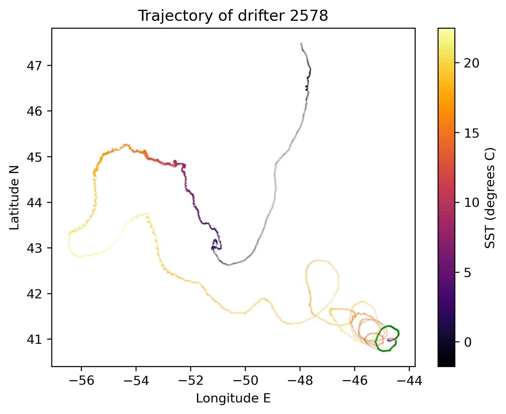
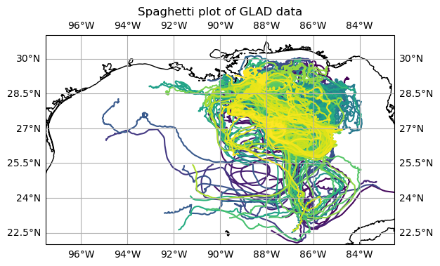
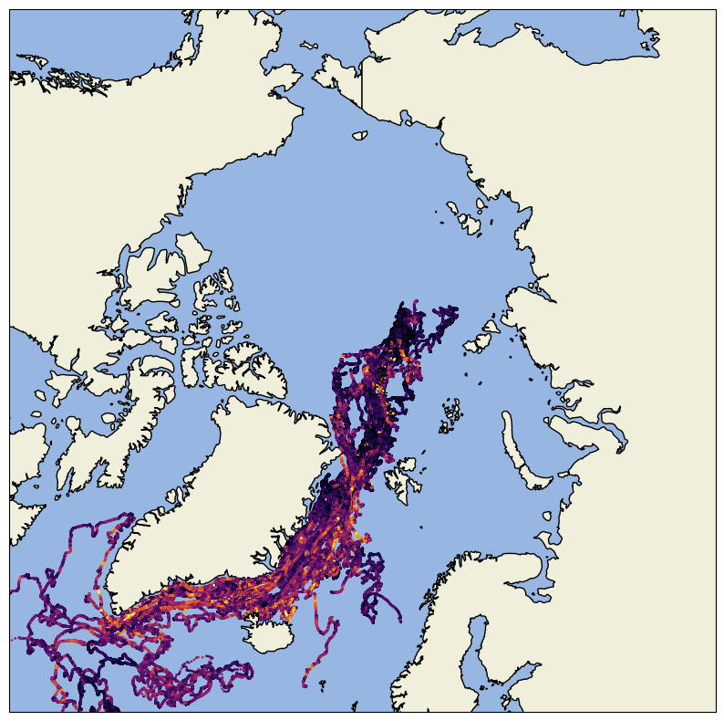
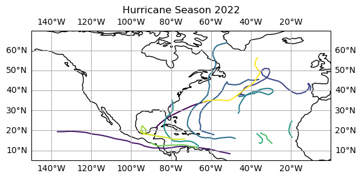
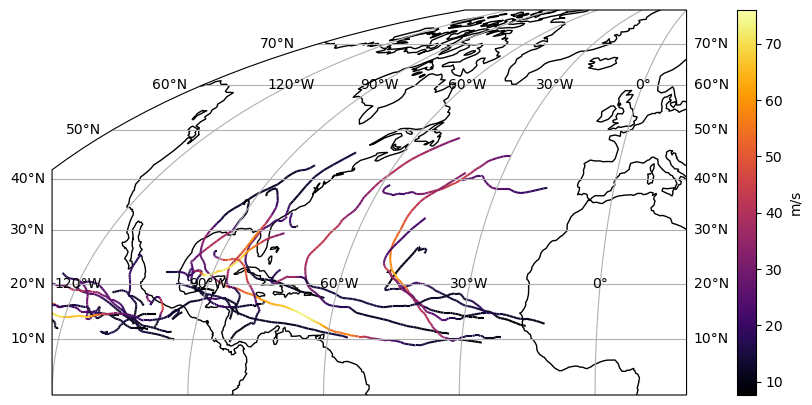

.. _datasets:

Datasets
========

.. contents::
   :local:
   :depth: 2

CloudDrift provides convenience functions to access real-world ragged-array
datasets. Currently available datasets are:

Global Drifter Program (GDP) Datasets
-------------------------------------

- :func:`clouddrift.datasets.gdp1h`: 1-hourly Global Drifter Program (GDP) data
  from a `cloud-optimized Zarr dataset on AWS <https://registry.opendata.aws/noaa-oar-hourly-gdp/.>`_.
- :func:`clouddrift.datasets.gdp6h`: 6-hourly GDP data from zarr archive hosted on a public AWS S3 bucket accessible at `s3://noaa-oar-hourly-gdp-pds/experimental/ <https://noaa-oar-hourly-gdp-pds.s3.amazonaws.com/index.html#experimental/>`_.
- :func:`clouddrift.datasets.gdp_source`: source GDP data without being pre-processed unlike
  the 6-hourly/1-hourly datasets that are derived from it.

You can find examples of how to use the GDP datasets in the `GDP Get-Started Notebooks <https://github.com/Cloud-Drift/gdp-get-started>`_.

GLAD Dataset
------------

:func:`clouddrift.datasets.glad`: 15-minute Grand LAgrangian Deployment (GLAD)
data produced by the Consortium for Advanced Research on Transport of
Hydrocarbon in the Environment (CARTHE) and hosted upstream at the `Gulf of
Mexico Research Initiative Information and Data Cooperative (GRIIDC)
<https://doi.org/10.7266/N7VD6WC8>`_.

You can find examples of how to use the GLAD datasets in the `GLAD Get-Started Notebooks <https://github.com/Cloud-Drift/glad-get-started>`_.

MOSAiC Dataset
--------------

:func:`clouddrift.datasets.mosaic`: MOSAiC sea-ice drift dataset as a ragged
array processed from the upstream dataset hosted at the
`NSF's Arctic Data Center <https://doi.org/10.18739/A2KP7TS83>`_.

You can find examples of how to use the MOSAiC datasets in the `MOSAiC Get-Started Notebook <https://github.com/Cloud-Drift/mosaic-get-started>`_.

HURDAT2 Dataset
---------------

:func:`clouddrift.datasets.hurdat2`: The HURricane DATa 2nd generation (HURDAT2)
processed from the upstream dataset hosted at the `NOAA AOML Hurricane Research Division <https://www.aoml.noaa.gov/hrd/hurdat/Data_Storm.html>`_.

You can find examples of how to use the HURDAT2 datasets in the `HURDAT2 Get-Started Notebook <https://github.com/Cloud-Drift/hurdat2-get-started>`_.

IBTrACS Dataset
---------------

:func:`clouddrift.datasets.ibtracs`: The International Best Track Archive for Climate Stewardship (IBTrACS) as a ragged array xarray dataset.
Processed from the upstream dataset hosted at the `NOAA NCEI IBTrACS <https://www.ncei.noaa.gov/products/international-best-track-archive>`_.

You can find examples of how to use the IBTrACS datasets in the `IBTrACS Get-Started Notebook <https://github.com/Cloud-Drift/ibtracs-get-started>`_.

Andro Dataset
-------------

:func:`clouddrift.datasets.andro`: The ANDRO dataset as a ragged array
processed from the upstream dataset hosted at the `SEANOE repository
<https://www.seanoe.org/data/00360/47077/>`_.

Subsurface Floats Dataset
-------------------------

:func:`clouddrift.datasets.subsurface_floats`: The subsurface float trajectories dataset as
hosted by NOAA AOML at 
`NOAA's Atlantic Oceanographic and Meteorological Laboratory (AOML) <https://www.aoml.noaa.gov/phod/float_traj/index.php>`_
and maintained by Andree Ramsey and Heather Furey from the Woods Hole Oceanographic Institution.

Spotters Dataset
----------------

:func:`clouddrift.datasets.spotters`: The Sofar Ocean Spotters archive dataset as hosted at the public `AWS S3 bucket <https://sofar-spotter-archive.s3.amazonaws.com/spotter_data_bulk_zarr>`_.

YoMaHa'07 Dataset
-----------------

:func:`clouddrift.datasets.yomaha`: The YoMaHa'07 dataset as a ragged array
processed from the upstream dataset hosted at the `Asia-Pacific Data-Research
Center (APDRC) <http://apdrc.soest.hawaii.edu/projects/yomaha/>`_.

More Information
----------------

The GDP and the Spotters datasets are accessed lazily, so the data is only downloaded when
specific array values are referenced. The ANDRO, GLAD, MOSAiC, Subsurface Floats, and YoMaHa'07
datasets are downloaded in their entirety when the function is called for the first 
time and stored locally for later use.

Example Usage
----------------

>>> from clouddrift.datasets import gdp1h
>>> ds = gdp1h()
>>> ds
<xarray.Dataset> Size: 16GB
Dimensions:                (traj: 19396, obs: 197214787)
Coordinates:
    id                     (traj) int64 155kB ...
    time                   (obs) datetime64[ns] 2GB ...
Dimensions without coordinates: traj, obs
Data variables: (12/59)
    BuoyTypeManufacturer   (traj) |S20 388kB ...
    BuoyTypeSensorArray    (traj) |S20 388kB ...
    CurrentProgram         (traj) float32 78kB ...
    DeployingCountry       (traj) |S20 388kB ...
    DeployingShip          (traj) |S20 388kB ...
    DeploymentComments     (traj) |S20 388kB ...
    ...                     ...
    start_lat              (traj) float32 78kB ...
    start_lon              (traj) float32 78kB ...
    typebuoy               (traj) |S10 194kB ...
    typedeath              (traj) int8 19kB ...
    ve                     (obs) float32 789MB ...
    vn                     (obs) float32 789MB ...
Attributes: (12/16)
    Conventions:       CF-1.6
    acknowledgement:   Elipot, Shane; Sykulski, Adam; Lumpkin, Rick; Centurio...
    contributor_name:  NOAA Global Drifter Program
    contributor_role:  Data Acquisition Center
    date_created:      2023-09-08T17:05:12.130123
    doi:               10.25921/x46c-3620
    ...                ...
    processing_level:  Level 2 QC by GDP drifter DAC
    publisher_email:   aoml.dftr@noaa.gov
    publisher_name:    GDP Drifter DAC
    publisher_url:     https://www.aoml.noaa.gov/phod/gdp
    summary:           Global Drifter Program hourly data
    title:             Global Drifter Program hourly drifting buoy collection

