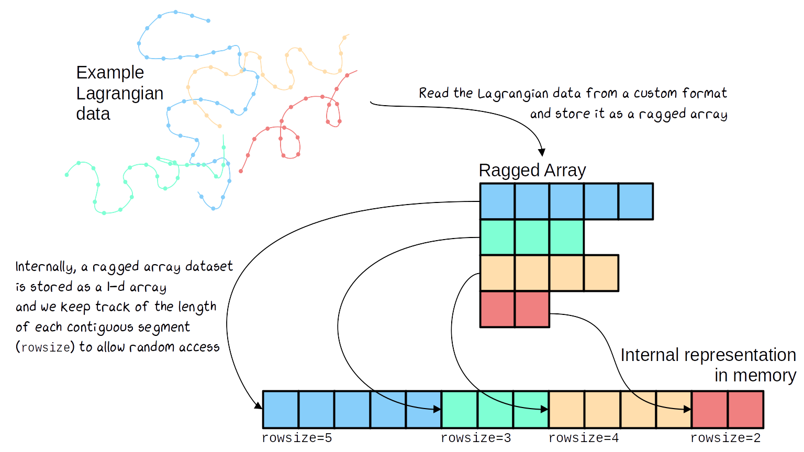

# Summary

Lagrangian data in Earth sciences are unique because they do not conform to established standards related to dimensions, coordinates, and organizational structures. In addition, because they convolve spatial and temporal information, Lagrangian data necessitate specific processing and analysis tools for their scientific and operational exploitations. The Clouddrift Python library addresses those challenges by offering tools to process and analyze Lagrangian data with an emphasis on the ragged array representation.

# Statement of need

In Earth, Ocean, Geo-, and Atmospheric Science, Eulerian typically refers to a type of data acquired or simulated at a particular fixed point or region in space. Eulerian data often materialize on fixed spatiotemporal grids with monotonic coordinates (e.g. latitude, longitude, depth, time) for which popular Python tools such as [xarray](https://docs.xarray.dev/en/stable/) are naturally suited. Eulerian data are often contrasted with Lagrangian data. Such data refers to information acquired by observing platforms drifting with a flow they are embedded within, but also more broadly refers to the data originating from uncrewed platforms, vehicles, virtual particles, atmospheric phenomena such as tropical cyclones, and even animals that gather data along their natural but complicated paths. Because such paths traverse both spatial and temporal dimensions, Lagrangian data often convolve spatial and temporal information that cannot consistently and readily be organized, cataloged, and stored in common data structures and file formats with the help of common libraries and standards. As an example, the concepts of dimensions and coordinates for Lagrangian data are ambiguous and not clearly established. As such, for both data generators and data users, Lagrangian data present challenges that the Clouddrift Python library aims to overcome. 

# Scope and key features

The scope of the Clouddrift library includes: 

1. **Working with contiguous ragged array representations of data, whether they originate from geosciences or any other field**. Ragged array representations are useful when the data lengths of the instances of a feature (variable) are not all equal. With such representations the data for each feature are stored contiguously in memory, and the number of elements that each feature has is contained in a count variable which Clouddrift calls *rowsize*. 
       
A graphical representation of the application of the ragged array structure to Lagrangian data is displayed in \autoref{fig:ragged_array}.

2. **Delivering functions and methods to perform scientific analysis of Lagrangian data, oceanographic or otherwise [@Lacasce:2008;@Vansebille:2018], structured as ragged arrays or otherwise**. A straightforward example of Lagrangian analysis provided by Clouddrift is the derivation of Lagrangian velocities from a sequence of Lagrangian positions, and vice versa. Another more involved example is the discovery of pairs of Lagrangian data prescribed by distances in space and time. Both of these methods are currently available with Clouddrift.

3. **Processing publicly available Lagrangian datasets into the common ragged array data structure and format**. Through data *adapters*, this type of processing includes not only converting Lagrangian data from typically regular arrays to ragged arrays but also aggregating data and metadata from multiple data files into a single data file. The canonical example of the Clouddrift library is constituted of the data from the NOAA Global Drifter Program [@Elipot:2022].

4. **Making cloud-optimized ragged array datasets easily accessible**. This involves opening in a local computing environment, without unnecessary download, Lagrangian datasets available from cloud servers, as well as opening Lagrangian dataset which have been seamlessly processed by the Clouddrift data *adapters*.    

# Acknowledgements

The development of the Clouddrift library is a result of [NSF Award #2126413: *EarthCube Capabilities: CloudDrift: a platform for accelerating research with Lagrangian climate data*](https://www.nsf.gov/awardsearch/showAward?AWD_ID=2126413). SE, PM, MC, and KS have been partially supported by this award. 

# References

